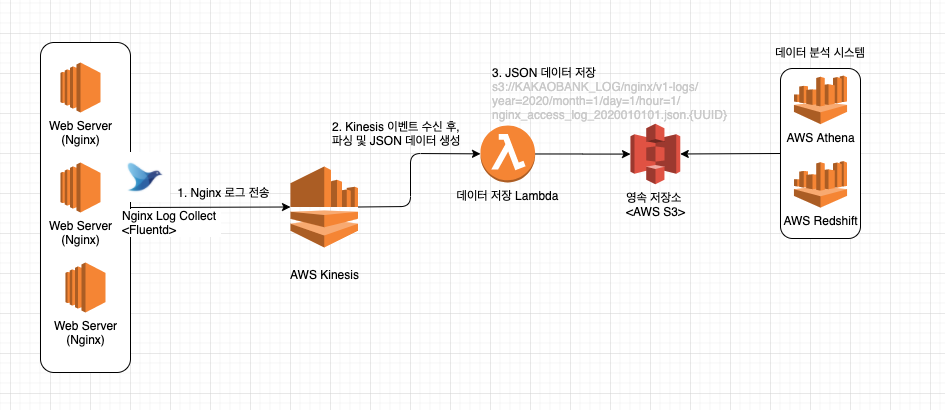

# Nginx Log Collect

# 기본 요구사항

* [x] 수집 대상 로그는 NGINX 웹서버의 접근 로그(Access Log)로 한정합니다.
* [x] 모든 로그를 1분 주기로 Kinesis Stream에 전송합니다.
* [x] Kinesis Stream에 모인 로그를 Lambda 함수를 통해 JSON 형식의 구조화된 로그(Structured Log)로 변환하여 S3에 저장합니다.
* [x] Lambda 함수 작성시 프로그래밍 언어는 Python, Node.js, Go 중 한 가지를 선택합니다.
* [x] JSON의 세부 형식은 사람이 인식하기 쉬운(Human-readable) 이름을 갖도록 정의합니다.
* [x] S3 저장 시 경로명과 파일명은 추후 Athena와 연동해 질의할 것을 고려하여 적절한 관례(Convention)를 정의해 지정합니다.
* [x] 이 모든 것을 [https://localstack.cloud](https://localstack.cloud)Community Edition을 이용해 로컬 환경에서 개발하고 테스트합니다. (실제 AWS 계정 필요 없음)
* [x] localstack 환경 구성 절차 및 개념 검증 수행 내용을 Markdown 문서로 정리합니다.

# 바로가기

* [Lambda 코드](./lambda)
* [Fluentd 설정파일](./td-agent.conf)

# POC

## 아키텍쳐



## 환경

* OS : Ubuntu 16.04.5 LTS (Xenial Xerus)
* CPU : 4 Core (Intel(R) Core(TM) i5-2500 CPU @ 3.30GHz)
* Memory : 4GB

## 수집

`Fluentd` 를 통한, Nginx 경로의 로그 수집

### 선정사유

전통적인 로그 수집 방식인 `logstash`를 고민 함.
로그 수집을 위하여, 비싼 EC2 자원을 낭비 하는 것보다는 경량화된 에이전트를 사용 하는 것이 맞다고 판단하여, `Fluentd` 를 사용하게 되었음.

### 에이전트 동작 방식

1. Input \<Source> (데이터 로그 수집)
해당 단계에서는 로그를 수집 하는 설정을 정의 합니다.

| Key | 설명 | 예시 |
| --- | --- | --- |
| @type | 수집 하는 파일을 읽을 방식에 대해 정의 합니다.<br>\* 해당 과제에서는 `tail` 모드를 사용합니다. | tail |
| path | 수집 하는 파일의 경로를 정의 합니다 | /var/log/nginx/access.log |
| pos\_file | `@type-tail` 스펙에서 사용되는 Option 값 입니다.<br>마지막으로 읽은 위치가 어디인지 저장 하는 인덱스 파일의 경로를 정의합니다. | /var/log/td-agent/nginx.access.pos |
| parse->@type | 해당 로그를 어떤 파서를 통해 파싱 할지에 대한 정보를 정의 합니다<br>이번 POC에서는 RAW한 로그를 통채로 읽었기 때문에 `none` 으로 설정하였습니다. | none |
| tag | 수집된 로그를 어디로 보낼 것인지에 대한 아이디를 정의합니다. | kinesis.nginx.access |

### Referense

* [https://docs.fluentd.org/input/tail](https://docs.fluentd.org/input/tail)

2. Output \<Source>
해당 단계에서 수집된 정보를 `Kinesis`로 전송하게 됩니다.

| Key | 설명 | 예시 |
| --- | --- | --- |
| @type | 어떤 형태의 플러그인을 사용 할 것인지에 대해 정의 합니다. \*`fluent-plugin-kinesis`의 추가적인 설치가 필요 합니다. | kinesis\_streams |
| stream\_name | 출력된 스트림의 이름을 정의 합니다. | v1-kakaobank-nginx-log-stream |
| aws\_key\_id | AWS Access Key를 정의 합니다. | - |
| aws\_sec\_key | AWS Secret Key를 정의 합니다. | - |
| region | kinesis가 설치된 AWS 리전을 입력 합니다. | ap-northeast-2 |
| buffer->flush\_interval | 수집된 로그를 전송할 interval에 대해 정의 합니다<br>\* 해당 POC에서는 요구사항에 따라 60초로 고정하여 사용 합니다. | 60 |
| buffer->flush\_thread\_count | 수집된 로그를 전송할때 사용 할 Thread Count에 대해 정의 합니다.<br>\* 이때 kinesis Stream의 샤드 수에 따라 결정이 필요합니다.  `최대 1MiB/초 및 1,000개 레코드/초를 수집하고 최대 2MiB/초를 방출합니다` | 10 |

### Referense

* [https://docs.fluentd.org/how-to-guides/kinesis-stream](https://docs.fluentd.org/how-to-guides/kinesis-stream)
* [https://github.com/awslabs/aws-fluent-plugin-kinesis](https://github.com/awslabs/aws-fluent-plugin-kinesis)

## 가공 (Lambda)

### 환경

- Runtime : Python >= 3.7 이상 (f-string 사용)

### 요구사항
-  다음과 같은 log\_format을 지원해야, 사용이 가능함. </br>
`$remote_addr - $remote_user [$request_time] "$method $uri $http_version" $status $body_bytes_sent "$http_referer" "$http_user_agent"`
- 대상 S3 Bucket에 READ/WRITE 권한 필요


### 처리방식

* INPUT 된 데이터에 대해 정규식 파싱 진행
* 파싱된 데이터를 기반으로 JSON 데이터 생성
* Multiline JSON 형태로 s3에 object 저장


### 데이터

* INPUT

```
172.69.68.213 - - [08/Jun/2020:17:25:31 +0900] "GET / HTTP/1.1" 502 65851 "-" "Mozilla/5.0 (Linux; Android 6.0.1; Nexus 5X Build/MMB29P) AppleWebKit/537.36 (KHTML, like Gecko) Chrome/80.0.3987.92 Mobile Safari/537.36 (compatible; Googlebot/2.1; +http://www.google.com/bot.html)"
```

* OUTPUT

``` json
{
  "remote_ip": "172.69.68.213",
  "remote_user": "-",
  "request_time": "2020-06-08T17:25:31+09:00",
  "method": "GET",
  "uri": "/",
  "http_version": "HTTP/1.1",
  "status": "502",
  "body_bytes_sent": 65851,
  "http_referer": "-",
  "http_user_agent": "Mozilla/5.0 (Linux; Android 6.0.1; Nexus 5X Build/MMB29P) AppleWebKit/537.36 (KHTML, like Gecko) Chrome/80.0.3987.92 Mobile Safari/537.36 (compatible; Googlebot/2.1; +http://www.google.com/bot.html)"
}
```

| key | 설명 | 비고 |
| --- | --- | --- |
| remote\_ip | 접속자의 IP | - |
| remote\_user | Basic Auth를 사용 한 경우의 UserName | - |
| request\_time | 접속 요청 시간 ([ISO 8601 스펙](https://ko.wikipedia.org/wiki/ISO_8601)) | - |
| method | 접속 정보 Method | - |
| uri | 접속 요청 경로 | - |
| http\_version | 접속 요청 HTTP 버전 스펙 | - |
| status | 응답 코드 | - |
| body\_bytes\_sent | 응답 바디 사이즈 (Byte) | - |
| http\_referer | 접속자 Referer 정보 | - |
| http\_user\_agent | 접속자 User Agent | - |

#### Referense

* [https://docs.aws.amazon.com/athena/latest/ug/partitions.html](https://docs.aws.amazon.com/athena/latest/ug/partitions.html)
* [http://nginx.org/en/docs/http/ngx\_http\_log\_module.html](http://nginx.org/en/docs/http/ngx_http_log_module.html)

## 영속저장소(S3) 저장

### KEY 저장 전략

``s3://{bucket_name}/nginx/v1-logs/year={YYYY}/month={MM}/day={DD}/{YYYY-MM-DD-HH:mm}.json.{UUID}``

#### 특징

-  `Athena` 등의 데이터 분석 솔루션 사용시, 효율적인 데이터 호출 및 분석을 위하여, 시계열 기반 Object Key 전략 사용
-  스키마 변경 발생을 대비하여, 분기가 가능한 경로 추가

## LocalStack 환경 구성

### 구축 방식

* Docker를 통한 `LocalStack` 구축

### Required

* docker-compose
* docker

### 구축 방법

1. git clone [https://github.com/localstack/localstack](https://github.com/localstack/localstack)
2. 아래의 명령 실행

``` bash
export SERVICES=s3,kinesis,lambda
export TMPDIR=/private$TMPDIR 
export PORT_WEB_UI=8080
export DEBUG=0
docker-compose -f ./localstack/docker-compose.yml up -d
```

3. aws cli 사용시 `--endpoint-url=http://localhost:4572` 옵션을 통하여, 명령 수행

### 서비스별 endpoint url

| 서비스명 | endpoint url | 비고 |
| ---- | ------------ | --- |
| s3 | [http://localhost:4572](http://localhost:4572) | - |
| Kinesis  | [http://localhost:4568](http://localhost:4568) |  |
| Lambda | [http://localhost:4574](http://localhost:4574) | - |

### Referesnse
* [https://github.com/localstack/localstack](https://github.com/localstack/localstack)
* [https://woowabros.github.io/tools/2019/07/18/localstack-integration.html](https://woowabros.github.io/tools/2019/07/18/localstack-integration.html)
* [https://docs.aws.amazon.com/ko\_kr/cli/latest/userguide/cli-configure-options.html](https://docs.aws.amazon.com/ko_kr/cli/latest/userguide/cli-configure-options.html)